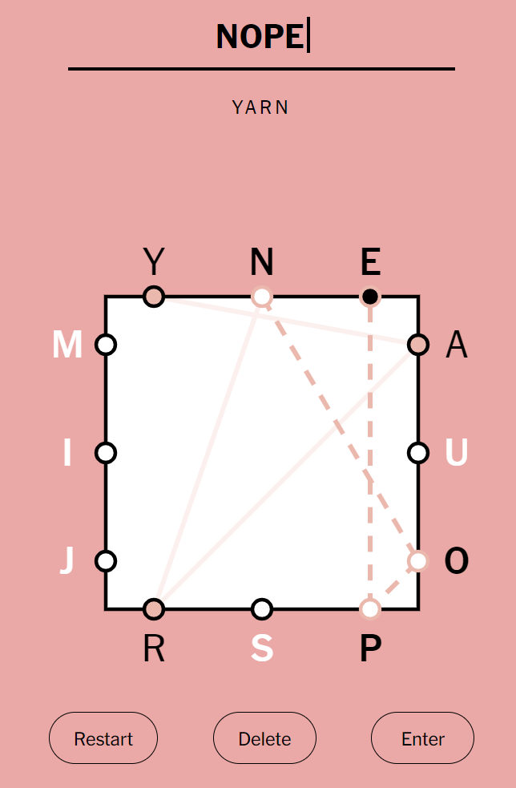

A recreation of the [New York Times' Letter Boxed Game](https://www.nytimes.com/puzzles/letter-boxed)

Improvements over the original:
  - Minor UI layout improvements on various screen sizes
  - Progressive Web App (PWA) for installation and offline play
  - Archive of past puzzles
  - Puzzles generated from large corpora of English poetry
  - Share button

Missing:
  - Animations (https://github.com/joeyparrish/letterboxed/issues/2)
  - Interface to create custom puzzles (https://github.com/joeyparrish/letterboxed/issues/3)
